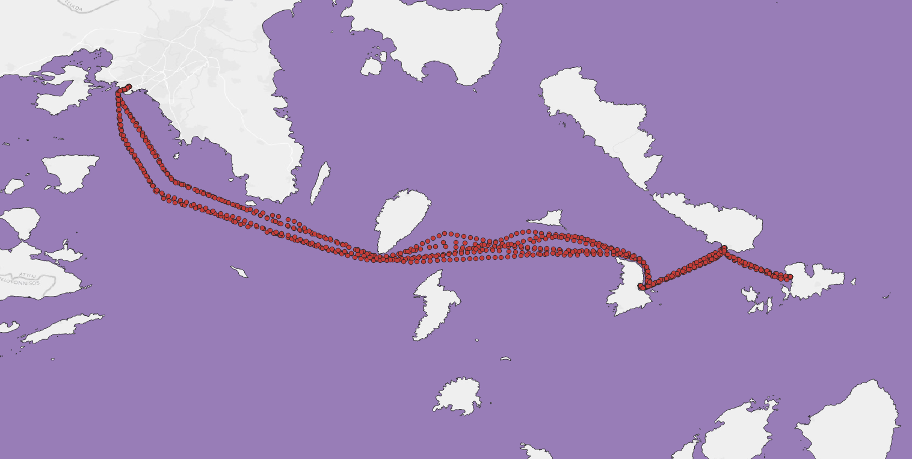
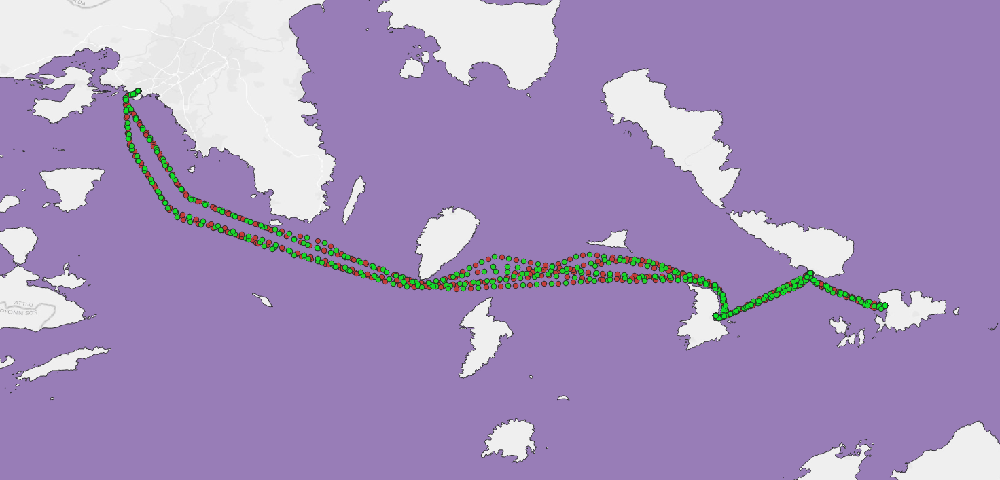
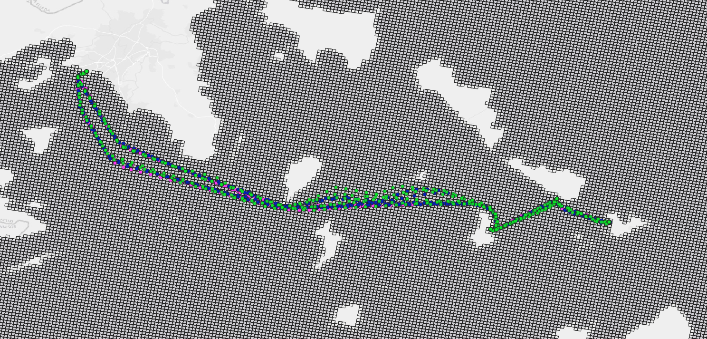
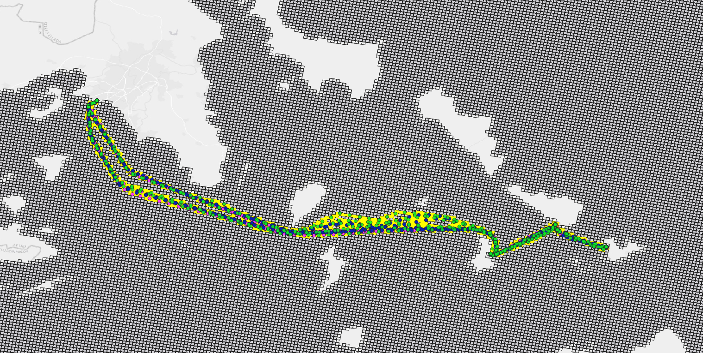
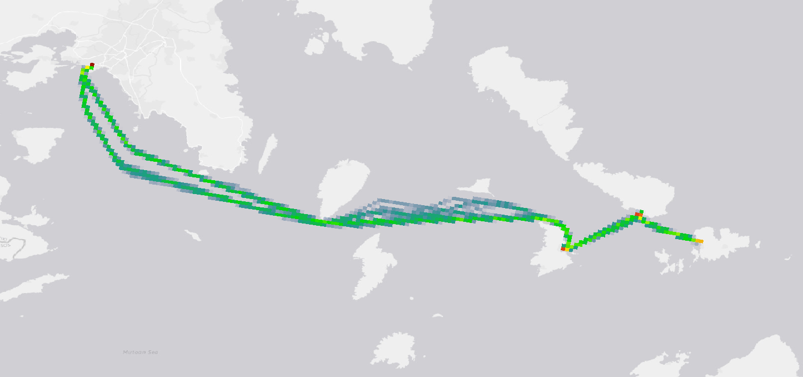

# Marinetraffic AIS toolbox

## Overview

 This document provides a brief overview of process, as well as the data and tools required, to generate density maps using "Marinetraffic AIS toolbox". The data used in this overview are decoded historical Automatic Identification System (AIS) data.
 

## Installation - prerequisites

We strongly recommend running this module in virtual environment to ensure packages compatibility. 
	
	git clone https://github.com/marinetraffic/mt-ais-toolbox.git;
	cd mt-ais-toolbox/;
	python3 -m venv .venv;
	source .venv/bin/activate;
	pip install -e .;
	export USE_PYGEOS=1;

Package installation in the virtual environment

	pip install -e .

To deactivate the virtual environment use:

	deactivate

The package can also be installed directly from our gitub repo with the following command, however additional 
changes in paths are required to run the following examples.

	pip install git+https://github.com/marinetraffic/mt-ais-toolbox.git;

Check also the [configuration section below](#Configuration)

Note: it is recommended to set the following system variable to speed up pygeos spatial joins:

	export USE_PYGEOS=1

### Installation on Windows OS

This toolbox relies on GDAL library, for rasterization processs mainly, thus installing it in windows operating system will require 
a working installation of GDAL across your system. 

To use this module in windows you are required to have a working GDAL installation before installing this toolbox. A workaround is installing GDAL through OSGeo4w (https://trac.osgeo.org/osgeo4w/) and define the appropriate paths to use the included python version instead. In addition, you  have to include the bin directory of osgeo installation folder to you PATH environmental variable.

## Technical Specifications
- Python version 3.8.6 or later. & installation of "requirements.txt" packages
- GDAL 3.0.4 ( In ubuntu systems you may execute *apt-get install gdal-bin libgdal-dev*)

	
## Quick Start

This package includes 
 - A configuration.json file that determines:
	- the AIS file path
	- the geometry file paths
	- the grid cells' size for cleaning and density-maps creation 
	- runtime parameters regarding the data cleaning and filtering process

- Implementations for:
	- Loading AIS data
	- Cleaning the data
	- Generating grid
	- Generating density map using GDAL
	
	
 
 
Each step of our approach requires some parameters that include: paths for input files and output directories, flags regarding the operation to be executed, additional thresholds required during execution (e.g. downsampling rate). All that information should be included within a configuration file, that it should be passed as an argument during execution (e.g. config/config.json).

# The process
## Loading and merging data

For the loading of the AIS messages compressed comma-separated values files should be included (format .csv.bz2). These files should have the messages ordered by their timestamps. In case there are multiple input files they must be ordered alphabetically so that files with earlier messages come first.

### Binding AIS positional reports with static reports (Merging)
  Merge decoded data: AIS messages (static and positional) would be merged so that each positional message includes additional information originating from the corresponding static AIS messages.
  The merging process can be executed by:
 
	python -m mt.cleaning.ais_merge config/config.json 

### Input format

In case the message is static report:

	t,station,channel_code,mmsi,type,data_type,imo;shiptype;to_bow;to_stern;to_port;to_starboard;callsign;shipname;draught;destination;eta_month;eta_day;eta_hour;eta_minute

In case the message is a positional report:

	t,station,channel_code,mmsi,type,data_type,lon;lat;heading;course;speed;rot_direction;rot;navigation_status

*Original sample dataset for a single vessel.*

## Cleaning erroneous or incomplete messages (Cleaning)
Clean merged data: after merging all AIS messages should go through the filters indicated in the config file. These may include: checking validity of movement fields, validity of vessel ID (MMSI), the land mask and others (see **Filters** section below). Input and output directories and the filters to be applied are defined on the configuration file given. 
The cleaning process can be executed by:

	
	python -m mt.cleaning.data_cleaning config/config.json 

*Clean dataset (green) for the same vessel. The red messages are filtered out.*

## Density maps generation
The density map generation step reads the cleaned ais files and generates density maps with respect to the selected method in the configuration file. There are two options available, the first one measures the number of vessels within each cell while the second one aggregates the time spent within each cell of all vessels crossing it. 

	
	python -m mt.density.export_density_maps config/config.json 

*1km side grid used to calculate density maps. Cleaned positions of three vessels*

*The rasterization process.*

*The resulting map of time_at_cells method in geo-referenced tiff format and colormap as provided in configuration.*

### Filters
The filters provided by the Marinetraffic AIS toolbox include:
- Removing all messages with empty coordinates, timestamp, speed or course fields.
- Removing points outside the area of interest (as defined from the configuration file), including points on land. 
	- Supported geometry file types are (geopackage,geodatabase,geojson).
- The AIS data are down-sampled according to the configuration ratio provided (in milliseconds). The downsampling is performed so that two consecutive messages from the same vessel could not have a time interval shorter than the threshold. Naturally, as a result of this process duplicate signals are removed.
- Messages with wrong MMSI numbers are removed (according to the list provided in the configuration file).
- Signals with invalid speed and course over ground(SOG/COG) values are removed.
- Noise messages were removed. This is achieved by eliminating messages that indicate improbable transitions, i.e. where vessels would have needed to move with a speed over 92.0 knots.
- Vessels with total messages fewer than a given threshold are not processed and all their AIS messages are discarded.

The configuration file given determines which of the above filters would be applied.

# Configuration

The Marinetraffic AIS toolbox configuration file is a json file that consists of the parameters that control among others the input and output paths, adjust the sensitivity of the data cleaning process and control other aspects of the map generation process.   

| *Parameter* |	*Description*                                   | *Default Values* |
|:----------|:---------------------------------------------------|:--------------|
|"geometry_file_path" | Path for geometry file used| in config|
|"grids_path"| Path for saving grid | in config |
|"ais_path"|Path of merged AIS messages directory| in config |
|"ais_cleaned_path"|Path of cleaned AIS messages directory|  in config |
|"ais_decoded_path"| Path of merged AIS messages directory |  in config |
|"density_path"| Path of resulting density files directory |  in config |
|"colors_files_path"| Path of density file (TIFF) color files directory   |  in config |
|"ais_stats_path"|Path for the statistics directory|  in config |
|"out_crs"| Output coordinate reference system code (CRS 3035 or 3857(not tested) ) | 3035 |
|"empty_fields"|If true removes messages with empty fields | false |
|"invalid_movement_fields"|If true removes messages with invalid values in COG,SOG,LON,LAT fields| false |
|"invalid_mmsi"|If true removes messages with invalid mmsi values (see below)| false |
|"false_mmsi"|List of MMSIs to be excluded| in config |
|"land_mask"|If true it enforces land-masking process| false |
| "bounding_box"|  List of coordinates that indicate the area of interest. The coordinates are in the format: [minLon, minLat, maxLon, maxLat], and must follow the output projection system | optional in config (example: [5905000, 2185000, 5910000, 2190000])|
|"downsample"|If true it enforces downsampling process| false|
|"downsample_rate"| Downsampling rate (in milli-seconds)| in config (example: 180000 ~ 3 mins) |
|"noise_filter"|If true it enforces noise filtering process by eliminating messages that indicate improbable transitions|in config |
|"grid_edge_lengths"|List of grid cell lengths for the grid generation. Each length indicates the size of edge on each dimension (in meters), resulting in a .| in config (example: [500000,200000,10000])|
|"timeframe"| If true it enforces a filter regarding each messages timestamp. If true, the "start_time"/"end_time" must be defined (using the EPOCH representation - in milliseconds) | false|
|"start/end_time"| The startin/ending times for the teimframe filter (in milliseconds) | in config (example: 1647592893000)|
|"min_positions"|Number of minimum AIS messages for the file to be included in the cleaning process| 10|
|"max_threads"| Maximium number of threads during execution; only for the processes that work in parallel| 4 |
|"density_method"| Method to be used for density maps 'vessels_count'(default) or 'time_at_cells' |'vessels_count' |
|"density_vessel_types"|List of types of vessels to be considered while creating density maps. One map will be generated for each vessel type, based on the type codes provided in the AIS. The 'All' option includes all vessels regardless their type. Options include: ['All', 'Cargo', 'Tanker', 'Dredging', 'HSC', 'Fishing', 'Military_Law', 'Passenger', 'Pleasure', 'Sailing', 'Service', 'Tug', 'Unknown', 'Other']|'All'|

Directory ('colors_files_path')  with color files should include a TXT file, named 'colors_{GEL}.txt' with GEL is the each grid edge length in meters (example: 'colors_1000.txt'). Each file should include the density thresholds followed by the appropriate color, expressed as RGB and with an opacity indicator (0-255).

# Licenses - Requirements
You may extract requirements from imports using the command : *pipreqs --force*

You may use the *pip-licenses* package to check dependencies licences  

	pip-licenses -p pyproj geopandas Fiona haversine pandas Shapely

results in :

	Fiona      1.8.21   BSD License 
	Shapely    1.8.2    BSD License 
	geopandas  0.10.2   BSD         
	haversine  2.5.1    MIT License 
	pandas     1.4.2    BSD License 
	pyproj     3.3.1    MIT License 

## Acknowledgement :
 ***This work has been partially funded by the European Maritime and Fisheries Fund (EMFF) through service contract No. CINEA/EMFF/2020/3.1.16/Lot2/SI2.850940***

## License Terms 
 This work is licensed under a <a rel="license" href="http://creativecommons.org/licenses/by-nc-sa/4.0/">Creative Commons Attribution-NonCommercial-ShareAlike 4.0 International License</a>.
